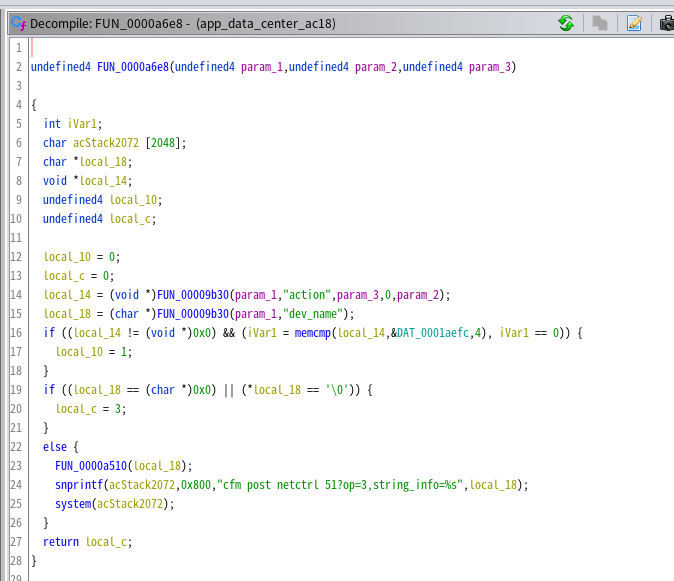

## Tenda AC18 CMD Injection

Vulnerability for Tenda AC18 Router AC1900 Smart Dual-Band Gigabit WiFi Router

Product: Tenda AC18

Version: The latest firmware -- V15.03.05.19(6318)_CN (Download link: https://www.tenda.com.cn/download/detail-2683.html)

Vulnerability Type: Command Injection

## Vulnerability description
-------------------------

An issue was discovered on Tenda AC18 devices with firmware through V15.03.05.19(6318)_CN. A command Inject vulnerability allows attackers to execute arbitrary OS commands via shell metacharacters in a crafted POST request. This occurs when the `FUN_0000a6e8` function calls system to run operation with an untrusted input parameter named `dev_name`. Consequently, an attacker can execute any command remotely when they control this input. The details are as below:

