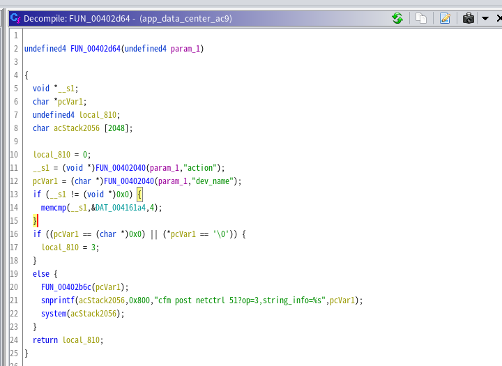
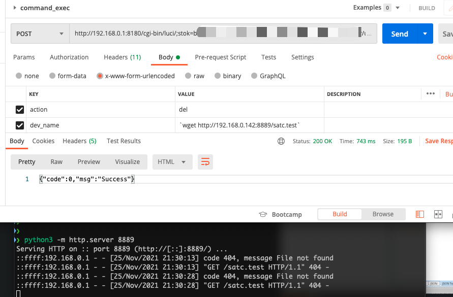

## Tenda AC9 app_data_center CMD Inject

Vulnerability for Tenda AC9 WiFi Router

Product: Tenda AC9

Version: The lastest firmware -- V15.03.06.42_multi [Download](https://www.tenda.com.cn/download/detail-2908.html)

Vulnerability Type: Command Injection

### Vulnerability description

An issue was discovered on Tenda AC15 devices with firmware through V15.03.06.42_multi. A command Inject vulnerability allows attackers to execute arbitrary OS commands via shell metacharacters in a crafted POST request. This occurs when the `FUN_00402d64`function calls system to run operation with an untrusted input parameter named `dev_name`. Consequently, an attacker can execute any command remotely when they control this input. The details are as below:

POC:

